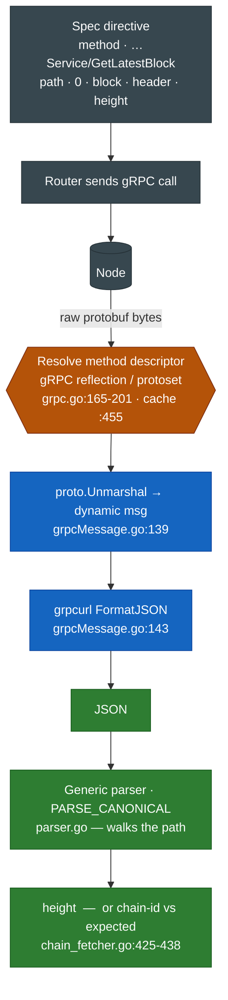
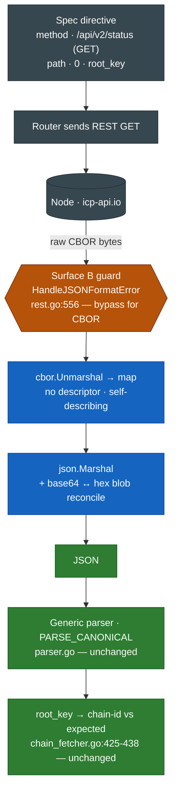

# CBOR Support in smart-router — Design & Feasibility

| | |
|---|---|
| **Ticket** | [MAG-2193](https://magmadevs.atlassian.net/browse/MAG-2193) — Research adding CBOR support to smart-router |
| **Driver** | [lava-specs PR #78](https://github.com/Magma-Devs/lava-specs/pull/78) — add ORIGYN chain spec (blocked) |
| **Status** | Draft / research complete — pending scope decision |
| **Author** | Anna Rayer |
| **Scope** | `smart-router` relay + parser; `lava-specs` spec model |

---

## TL;DR

The Internet Computer (ICP) HTTP interface is **CBOR-encoded end to end**; `smart-router` is JSON-only, so every parse directive and the mandatory chain-id verification fail on boot. ORIGYN (a suite of IC canisters) therefore cannot be onboarded without router changes.

**Decoding CBOR is feasible and low-risk** — it rides the exact seam gRPC already uses to turn a binary wire format into JSON before the parser runs. But **"CBOR support" is only the first of three layers**, and the IC's data model breaks assumptions Lava is built on (no chain-id, no block height, no byte-stable responses):

- **L1 — CBOR response decode** (~3–5 dd): unblocks chain-id verification and read-only responses. Small, isolated, proven pattern.
- **L2 — request-side CBOR + Candid** (~1–2 wk): serve real `query`/`call` relays. Most of the weight (signing) stays **client-side** because Lava is a pass-through relay.
- **L3 — block-tracking + QoS** (**zero**, via L3b): **no block tracking.** An IC "chain" is an application spread across *independent subnets* — ORIGYN's canisters occupy **7** — each its own blockchain with its own height and no shared clock. Any head observes exactly one subnet while traffic goes to all of them, and the counters cannot be combined. So no single number can represent the chain's head (§5.3.2).

**Recommended MVP: L1 + L2a (relay pass-through) + thin L2b (one canister-scoped verification) + L3b (no block tracking).** Ships ORIGYN with the client's IC agent carrying the signing burden. Block-derived features (QoS sync, consistency, fork detection, archive routing, caching) go inert — none error; their preconditions don't exist on IC. The router still relays, scores availability and latency, and fails over.

**L1, L2a and L3b are implemented and verified live** (§0). **Thin L2b is not**, and it is in the MVP for a correctness reason rather than polish: `root_key` proves only "this is IC mainnet" — it passes even for a provider that cannot reach a single ORIGYN canister. A canister-scoped check (`icrc1_symbol() → "OGY"`) is the only boot-time proof the chain's canisters are reachable. It turns out this **cannot be a spec directive** (`ingress_expiry` is dynamic, the body is binary), so it needs a Go-side verification hook — **Route A, 3–5 dd**, pending approval (§5.2, §8 decision 9).

**Conditional add-on, not default:** L3c (poll `icrc3_get_blocks(…).log_length` on a pinned anchor — live-verified at **1,380,764** on the OGY ledger) is worth building **only if OGY-ledger traffic dominates**, since the anchor watches one subnet out of seven. Certificate verification (former L3a) stays a deferred *integrity* upgrade; L2b stays demand-gated.

**Prerequisite (checked ✓ — no escape hatch):** no decentralized JSON gateway fronts the IC canister RPC surface — the agent API is CBOR-only by spec and there is no Blockfrost-equivalent — so CBOR work is genuinely required. Narrow exception: the **OGY token** ledger is serveable as JSON today via self-hosted Rosetta (uncertified), a possible *separate* quick win but not a substitute for the NFT/canister surface. See [§9.1](#91-serve-origyn-via-a-json-gateway-the-cardano-pattern--prerequisite-check--answered-no-narrow-token-exception).

---

## 0. Implementation status

| Layer | Status | Evidence |
|---|---|---|
| **L1** — CBOR decode + identity | ✅ **Implemented & verified live** | `health` against `icp-api.io` reports `ok: true`; previously failed at `rest.go:556` |
| **L2a** — relay pass-through | ✅ **Implemented & verified live** | canister queries relayed through the router: `icrc1_symbol` → `"OGY"`, `icrc1_total_supply` → `1041447811516099738`, `icrc1_decimals` → `8`, all HTTP 200 / `status: replied` |
| **L3b** — no block tracking | ✅ **Verified** | `latestBlock: 0`, pod healthy, nothing errors |
| **thin L2b** — canister-scoped verification | ✅ **Implemented & verified live** (Route A) | `origyn-identity` verification passes: the router crafts the CBOR envelope in Go, queries `icrc1_symbol` on the OGY ledger, and matches `"OGY"`. Negative control with a wrong `expected_value` fails as it should. |
| L3c / L3c-certified / full L2b | Not started — conditional or deferred | see §5.3.2, §5.3.5 |

**What shipped:** an explicit `CollectionData.Encoding` field (empty = JSON, so every existing chain is untouched), a CBOR→JSON transcoder on the message seam, the pre-parser guard bypass, a content-type fix on the direct-relay path, and Route A's Go-side envelope construction for canister-scoped verifications.

**How Route A landed (the hybrid shape).** The spec stays declarative — it pins the canister in the directive's `api_name`, names the method in `function_template`, and keeps `expected_value` in the verification block:

```jsonc
{ "name": "origyn-identity",
  "parse_directive": {
    "api_name":          "/api/v2/canister/lkwrt-vyaaa-aaaaq-aadhq-cai/query",  // canister pinned here
    "function_template": "icrc1_symbol",                                        // method
    "result_parsing":    { "parser_func": "PARSE_CANONICAL", "parser_arg": ["0","reply","arg"] }
  },
  "values": [{ "expected_value": "OGY" }] }
```

Go supplies only what a static template physically cannot: the CBOR envelope and a fresh `ingress_expiry`. Two design points worth keeping:

- **Dispatch is on `CollectionData.Encoding`, not a chain-ID `case`** — so it generalises to any IC chain and adds nothing to the switch the codebase already flags as debt.
- **The transcoder Candid-decodes `reply.arg`**, so `expected_value` stays readable (`"OGY"`) instead of being the hex of a Candid encoding. It is narrow and non-destructive: only that exact reply shape, only for single primitive returns, and anything it cannot decode degrades to hex rather than failing.

A concrete `api_name` still matches the spec's `{effective_canister_id}` api entry the same way a client request does — no new spec field was needed.

**Two findings from implementation that the design above did not predict:**

1. **There are two send paths, not one.** `protocol/rpcsmartrouter/direct_rpc_relay.go` handles actual client relays and hardcoded `ContentType: "application/json"`; only *verification probes* go through `chainlib/rest.go`. An IC boundary node rejects a CBOR body labelled as JSON with `Unexpected content-type, expected application/cbor`. §4 maps the chainlib seam only — the direct-relay path is a parallel surface that must be updated alongside it. *(Its response check is friendlier than `rest.go`'s: it only rejects bodies that **look** like JSON and aren't, so CBOR passes without a Surface-B bypass there.)*
2. **The drafted `origyn.json` has a defect.** It duplicates the `chain-id` verification onto the **POST** collection, but `/api/v2/status` is GET-only — the router resolves it on a different connection type and the parse fails. It must be removed from the POST collection in lava-specs PR #78; no router change fixes it.

---

## 1. Background & motivation

`smart-router` is a fork of the Lava protocol relay. It sits between RPC consumers and provider nodes, verifying provider identity/health, tracking chain head for QoS and finalization, and parsing responses to extract block numbers and verification values. All of this assumes **JSON** response bodies.

**The driver — ORIGYN (PR #78).** ORIGYN is not an independent L1. It is a suite of canisters (NFT/certificate, storage, sales; native token **OGY**) deployed on the Internet Computer. The RPC surface a Lava provider can serve is therefore the **IC boundary-node HTTP interface** (`icp-api.io`, `ic0.app`), defined by the [IC Interface Specification](https://internetcomputer.org/docs/references/ic-interface-spec). That interface is **CBOR** (a binary, self-describing JSON-like encoding, wrapped in CBOR tag `55799`). There is no EVM / Cosmos / Tendermint surface.

**Why "a chain uses CBOR" is *not* the trigger.** Cardano is natively CBOR too (blocks, transactions, Plutus data, and its node-to-client protocol are all CBOR), yet `cardano.json` works today with zero CBOR handling. The reason: the Cardano spec targets **Blockfrost**, a JSON REST indexer that decodes Cardano's CBOR and serves JSON. From the router's view the wire is JSON — block height comes from a JSON field (`GET_BLOCKNUM` on `/blocks/latest` → `["0","height"]`), chain identity from a JSON field (`["0","network_magic"]` = `764824073`). The only CBOR that survives is opaque hex strings at `/…/cbor` endpoints (relayed, never parsed) and a pass-through `content-type` header for tx submission.

The trigger is **CBOR as the provider wire format**, which is exactly what the IC is and what Cardano-via-Blockfrost is not. See [§9](#9-alternatives-considered) for whether an IC equivalent of Blockfrost exists.

---

## 2. Problem statement

Booting `smart-router` against `icp-api.io` with the drafted `origyn.json` fails because JSON is assumed in **two independent places**, and neither can read a CBOR body:

1. **A pre-parser format guard** rejects any non-JSON REST body *before parsing even begins*.
2. **The parser** `json.Unmarshal`s the response to extract values.

On top of the encoding, the IC data model itself is a poor fit for Lava's assumptions:

| Lava assumption | Reality on the IC |
|---|---|
| A numeric/string **chain-id** in a response field | No chain-id. Identity is the `root_key` (DER-encoded BLS root key) from `/api/v2/status` — a fixed mainnet constant. |
| A **latest block number** reachable by a cheap parse directive | Not from the **system** API — status carries no height, and the nearest system value is a certified nanosecond `/time` inside a BLS-signed certificate. But the **application** layer does expose one: ICRC-3's `log_length` (§5.3). Reaching it costs L2 (Candid), not L1. |
| A **positional block argument** in the request (URL/params) | The block/state selector is carried **inside the CBOR request body**; there is no URL-level positional block argument. |
| **JSON** application payloads | Request/response payloads (`arg`, `reply.arg`) are **Candid** (DIDL) — a *second* binary encoding nested inside the CBOR envelope. |

---

## 3. Goals / non-goals

**Goals**
- Let `smart-router` decode CBOR response bodies so IC chain-id verification passes and read-only responses parse.
- Define a signal by which a spec declares "this collection's wire format is CBOR."
- Serve real ORIGYN `query`/`call` relay traffic.
- Give the chain a working, monotonic head for QoS — with evidence for what tier is achievable.

**Non-goals (for the MVP)**
- Making `smart-router` a full IC agent (signing update calls, key management) — that stays client-side.
- Certificate verification (hash tree + BLS + delegation) — deferred integrity upgrade, see [§5.3.5](#535-integrity--the-deferred-upgrade-former-l3a).
- Fork detection and archive/pruning routing — *possible* under ICRC-3 but out of MVP scope; byte-consistency data-reliability stays off for IC (see [§5.3](#53-l3--block-tracking--qos)).
- Onboarding IC chains other than ORIGYN (though the mechanism should generalize).

---

## 4. Current architecture (as-is)

### 4.1 The one seam that matters

Every response-side parse directive converges on a single JSON-typed contract:

```go
// protocol/parser/parser.go:31
type RPCInput interface {
    GetResult() json.RawMessage   // everything response-side flows through this
    ...
}
```

Binary wire formats are handled by **transcoding to JSON *before* the parser runs**, via a per-message hook dispatched centrally:

```go
// protocol/chainlib/chain_fetcher.go:653-669  (FormatResponseForParsing)
if customParsingMessage, ok := rpcMessage.(chainproxy.CustomParsingMessage); ok {
    parserInput, err = customParsingMessage.NewParsableRPCInput(respData)   // binary → JSON
} else {
    parserInput = chainproxy.DefaultParsableRPCInput(respData)              // wrap raw bytes AS json.RawMessage
}
```

- `CustomParsingMessage` interface: `protocol/chainlib/chainproxy/common.go:19`
- `DefaultParsableRPCInput` (the implicit "everything else is JSON"): `chainproxy/common.go:105-107`

### 4.2 The gRPC precedent (the model to copy)

gRPC responses are raw protobuf on the wire, then transcoded to JSON before the parser sees them — **there is no separate non-JSON parse path**:

```go
// protocol/chainlib/chainproxy/rpcInterfaceMessages/grpcMessage.go:133-148
func (gm GrpcMessage) NewParsableRPCInput(input json.RawMessage) (parser.RPCInput, error) {
    ... proto.Unmarshal(input, msg) ...
    formattedInput, err := gm.formatter(msg)                        // proto msg → JSON text (grpcurl FormatJSON / jsonpb)
    return ParsableRPCInput{Result: []byte(formattedInput)}, nil    // now JSON for the parser
}
```

The proto→JSON marshal itself is `jsonpb` at `protocol/chainlib/grpc.go:691`. **CBOR can follow this pattern exactly.**

### 4.3 The pre-parser JSON guard (the second, sneakier surface)

Before any parsing, the REST proxy reads the body raw (`rest.go:541`) but then **hard-rejects non-JSON**:

```go
// protocol/chainlib/rest.go:556  (inside SendNodeMsg)
err = rcp.HandleJSONFormatError(reply.RelayReply.Data)   // gojq.Parse; rejects non-JSON
// → "Rest reply is neither a JSON object nor a JSON array of objects"
```

`HandleJSONFormatError` is `protocol/chainlib/node_error_handler.go:337-343`. The same guard exists on Tendermint at `tendermintRPC.go:758`. REST error classification also `json.Unmarshal`s the raw body (`restMessage.go:75-108`). **A CBOR body dies here, long before the parser seam in §4.1.**

> ⚠️ **This section maps the chainlib seam only — there is a second send path.** `protocol/rpcsmartrouter/direct_rpc_relay.go` (`sendRESTRelay`) carries actual client relays in direct-RPC mode; `chainlib/rest.go` carries only verification/probe traffic. Anything wire-format-sensitive must be applied to **both**. Discovered during implementation, when relays failed with `Unexpected content-type, expected application/cbor` while verifications passed — see §0. The direct path's own response check is friendlier (`looksLikeJSONOpening(body) && !json.Valid(body)`), so a CBOR body passes it without needing a bypass.

### 4.4 Chain-id verification path

Chain-id is not special-cased — it is a spec `Verification` compared generically:

```go
// protocol/chainlib/chain_fetcher.go:425-438  (ChainFetcher.Verify)
rawData := parsedInput.GetRawParsedData()
if rawData != verification.Value { return ... "verify failed expected and received are different" }
```

The request is crafted (`chain_fetcher.go:341`), sent (`:348`), response formatted through `FormatResponseForParsing` (`:363`, the §4.1 dispatch), then parsed (`:372`). The `chainId` returned by `SendNodeMsg` comes from static proxy config, **not** the response (logging only). So the only response-derived identity check is the generic compare above — which runs on the JSON-normalized `parsedInput`.

### 4.5 Spec model — no protobuf

`smart-router` ported Lava's `x/spec/types` into **hand-written Go structs** in `types/spec/` — **there are no `.proto` or `.pb.go` files**. `api_interface` is a free `string` constrained to four constants:

```go
// types/spec/constants.go:13-16
APIInterfaceJsonRPC       = "jsonrpc"
APIInterfaceTendermintRPC = "tendermintrpc"
APIInterfaceRest          = "rest"
APIInterfaceGrpc          = "grpc"
```

The factory switch on these lives at `protocol/chainlib/chainlib.go:38-49` (`NewChainParser`), `:66-75` (`NewChainListener`), and `:237-243`. The only existing "encoding" field is `BlockParser.Encoding` (`api_collection.go:94-99`, constants `EncodingBase64`/`EncodingHex` at `constants.go:20-21`) — it governs *hash-byte* representation (base64/hex) for block parsing, **not** wire format. **Consequence: adding a CBOR signal is a Go-struct + JSON-tag edit, not a codegen change.**

### 4.6 Data-flow comparison — gRPC (proven) vs CBOR (proposed L1)

Both interfaces converge on the **same green spine**: the generic parser and the chain-id compare are byte-format-blind — they only ever see JSON. Each interface adds exactly **one** amber prerequisite *before* the transcode, and it's a *different* one:

- **gRPC** must resolve the protobuf **method descriptor** (protobuf is not self-describing) via reflection or a protoset.
- **CBOR-on-REST** must clear the pre-parser **JSON guard** (Surface B) — a hurdle gRPC never hits, because gRPC runs on its own proxy, not the REST path.

After the transcode, the two are identical.

**gRPC — block height (`GetLatestBlock`) / chain-id (`GetNodeInfo`), as shipped today:**



**CBOR — chain-id (`/api/v2/status` → `root_key`), proposed L1:**



**Legend** — 🟩 green = shared, format-agnostic (unchanged for CBOR) · 🟦 blue = transcode to JSON (the per-interface adapter) · 🟧 amber = the one prerequisite unique to each interface · ⬛ node = provider node.

**Takeaway:** CBOR's transcode is *strictly simpler* than gRPC's — it drops the entire descriptor-resolution box (CBOR is self-describing), and its only added hurdle is Surface B, a one-line gate rather than a subsystem. Everything green is reused verbatim.

---

## 5. Layered design

### 5.1 L1 — CBOR response decode

**Goal:** decode CBOR response bodies so identity verification passes and plain-map responses parse. **Approach:** transcode CBOR → generic value → JSON at the message seam (§4.1), mirroring gRPC.

**Two surfaces to clear (both required):**

| # | File:line | Change |
|---|---|---|
| 1 | `go.mod` | add `github.com/fxamacker/cbor/v2` (standard Go CBOR; not yet a dep — `ugorji` is only transitive) |
| 2 | `chainproxy/rpcInterfaceMessages/restMessage.go` | implement `CustomParsingMessage.NewParsableRPCInput`: `cbor.Unmarshal` → generic value → JSON, gated on the signal — **Surface A** (mirror `grpcMessage.go:133-148`) |
| 3 | `protocol/chainlib/rest.go:556` (+ `tendermintRPC.go:758`) | bypass/adapt `HandleJSONFormatError` for CBOR collections — **Surface B** (the pre-parser guard) |
| 4 | `restMessage.go:75-108` | CBOR-aware error classification (currently `json.Unmarshal`) |
| 5 | `types/spec/*.go` + spec JSON | the signal (below) |
| — | `chain_fetcher.go:341-438` | **no change** — decoded `root_key` flows through the existing generic compare |

> **Surface B is the easy-to-miss one.** A unit test on Surface A passes while the router still rejects CBOR at `rest.go:556` on boot.

**The signal — "how does the router know a collection is CBOR?"** (cheap either way, no proto):
- **(a)** Sniff the `content-type: application/cbor` header the draft already carries — zero schema change. *Good for the spike.*
- **(b)** New `Encoding`/`Format` field on `CollectionData` — small struct + JSON-tag edit. Most self-documenting. *Recommended for production.*
- **(c)** New 5th `api_interface` (`ic` / `rest-cbor`) — heaviest: touches all three switches + a dedicated ChainParser/Listener. Only if the IC path diverges materially.

**Recommendation:** sniff (a) for the spike → land explicit field (b) for production.

**The blob-representation reconciliation — the estimate's swing factor.** Decoding CBOR is the easy part; matching representations for the identity compare is the trap:

- `root_key` is a CBOR **byte string** → when transcoded to JSON it serializes as a **base64** string.
- The draft's chain-id `expected_value` is **hex** (266 hex chars = the 133-byte DER root key), with directive `encoding` unset.
- `parseResponseByEncoding` (`parser.go:515-533`) only ever normalizes **toward base64** (hex→bytes→base64; base64→as-is) — it never emits hex.
- The compare at `chain_fetcher.go:425-438` runs on the raw extracted string. **base64 ≠ hex → verification fails after a clean decode.**

Reconcile by pinning **transcoder blob-representation ↔ `expected_value` encoding together**. Simplest: emit base64 for blobs + set `expected_value` to base64. First spike task: confirm whether directive `Encoding` fires on the `PARSE_CANONICAL` *verification* path or only on block-hash parsing — that decides whether the lever is spec-side or transcoder-side.

**Why the identity spike is self-contained:** `/api/v2/status` is a **bodyless GET** — it needs only L1 response-decode and **zero** request-side CBOR/signing. "chain-id verification passes against `icp-api.io`" is a real, isolated go/no-go proof.

> ⚠️ **But `root_key` is not sufficient as a production `chain-id`.** It identifies *the Internet Computer*, not ORIGYN — every IC-based chain returns the same value, so two IC chains would pass each other's verification. Fine for the L1 spike; for production pair it with a canister-scoped constant. See [§5.3.9](#539-determinism--what-is-identical-across-all-ic-nodes).

**Estimate:** ~3–5 dd including the blob reconciliation, both surfaces, the signal, and a passing identity check.

---

### 5.2 L2 — request-side CBOR + Candid

**Goal:** serve real ORIGYN `query`/`call` traffic. These hit `/api/v2/canister/<effective_canister_id>/query` and `/call`, whose **request bodies are CBOR envelopes** and whose payloads are **Candid**.

The IC request envelope (self-describing tag `55799`):

```
55799({ "content": {…}, "sender_pubkey": blob?, "sender_sig": blob?, "sender_delegation": [...]? })
```

`content` fields (query/call): `request_type`, `canister_id` (blob), `method_name` (text), `arg` (blob, **Candid**), `sender`, `ingress_expiry` (nat ns, ~5-min window, anti-replay), `nonce` (≤32B). `read_state`: `request_type`, `paths` (≤1000, each ≤127 blobs), `sender`, `ingress_expiry`.

There are two consumers of L2 with very different weight:

#### L2a — the relay path (client → node): the light one
In Lava's proxy model the dApp is already an IC agent (`@dfinity/agent`, `agent-go`, Rust `ic-agent`) that builds **and signs** the CBOR envelope. The router only needs to:
- **not reject** the CBOR request/response at its JSON guards (Surface B, already handled in L1),
- **route** by `effective_canister_id`, which the **client supplies per request** — the drafted spec correctly models it as a `{effective_canister_id}` path placeholder, not a fixed value. Note it appears **twice** in a canister call: in the URL path (routes to the owning subnet) and again inside the CBOR body as `content.canister_id` (the actual call target). They are normally identical; a pass-through relay forwards both untouched and needs to parse neither.
- **relay bytes** in/out — including the async `call` flow: POST `/call` → `202 + request_id` → poll `/read_state` for `/request_status/<request_id>` (or the v3/v4 sync-call returning the certificate inline).

**In pass-through the router signs nothing and Candid-encodes nothing.** This is the realistic path to serving ORIGYN and is far lighter than building an agent.

#### L2b — router-originated requests (its own probes)

Whenever the router asks a canister something *itself* — rather than forwarding a client's bytes — it needs L2b. **This is not optional for a correct spec**: boot verifications are router-originated by construction (`ChainFetcher.Verify` crafts the request from the spec directive, §4.4), so any canister-scoped verification lands here.

These probes are **read-only → anonymous**. Per spec, if `sender = 0x04` (anonymous principal) then `sender_pubkey`, `sender_sig`, and `sender_delegation` **must be omitted** — so **no keys, no signing, ever**.

**L2b splits into two very different scopes. Do not conflate them:**

| | Scope | Needs a Candid library? | Cost |
|---|---|---|---|
| **Thin L2b** ✅ | *Fixed* queries with constant args, primitive return types (`text`, `nat`) | **No** | **~1–2 days** |
| **Full L2b** | Generic Candid codec for arbitrary user-supplied types | Yes | ~1–2 wk |

**Thin L2b needs no Candid codec at all**, because both the request args and the reply shapes are fixed and can be hardcoded — the same trick the SVM tracker uses for its poll body (§5.3.4):

- **Request arg** — a no-arg method is the 6-byte constant `DIDL\x00\x00`. Even `icrc3_get_blocks([{start=0,length=1}])` has constant arguments, so the entire arg blob can be baked in as a literal.
- **Reply decode** — `text` is `DIDL\x00\x01\x71<leb128 len><utf8>`; `nat` is `DIDL\x00\x01\x7D<leb128>`. Roughly ten lines each.
- **Envelope** — CBOR-encode a small `content` map (anonymous sender, canister id, method name, arg, fresh `ingress_expiry`).

This is empirically validated: the ~40-line client used for §10.3 does exactly this against mainnet and returned `"OGY"` from `icrc1_symbol()` and `1041448338293709989` from `icrc1_total_supply()`.

**Full L2b** — a real Candid codec — is only required when the router must encode or decode *arbitrary* types it did not know at build time. Nothing in the recommended MVP needs it; it stays demand-gated.

##### ⚠️ Thin L2b cannot be expressed as a spec directive (found during implementation)

The "~1–2 days, no Candid library" estimate above was **wrong about where the difficulty lies**. The codec was never the hard part; the missing *hook* is. A canister-scoped verification cannot be driven from a spec `parse_directive` at all:

```go
// protocol/chainlib/chain_fetcher.go:492 — the verification request body IS
// the spec's function_template, cast to bytes. No substitution, no decoding.
data := []byte(parsing.FunctionTemplate)
```

Against that, an IC canister query body needs:

```
CBOR{ "content": {
    "request_type":   "query",              // static ✓
    "sender":         0x04,                 // anonymous — static ✓
    "canister_id":    <principal bytes>,    // static ✓
    "method_name":    "icrc1_symbol",       // static ✓
    "arg":            DIDL\x00\x00,         // static ✓
    "ingress_expiry": <now + 240s, in ns>   // ← DYNAMIC ✗
}}
```

Two independent blockers, either one fatal:

1. **`ingress_expiry` must be computed per request.** The IC rejects any request whose expiry has passed and caps how far ahead it may be (~5 min) — it is the protocol's anti-replay mechanism. A value hardcoded in a spec file works for about five minutes, then fails permanently.
2. **The body is binary.** `function_template` is a JSON string field and raw CBOR is not valid UTF-8. Hex-encoding it in the spec does not help: nothing in the craft path decodes it back.

So the request **must be constructed in Go** — exactly what the SVM tracker does for its poll body via `CustomMessage` (§5.3.4). But that seam belongs to the chain *tracker*; the *verification* path builds requests from spec directives, and no equivalent Go-side hook exists today.

##### The three routes, and the decision

| Route | Approach | Blast radius | Cost |
|---|---|---|---|
| **A — Go-side verification hook** ✅ | A `CustomVerifier` extension point mirroring the custom-tracker seam; the IC verifier builds the envelope in Go and sends it via `CustomMessage` | **IC only** — nothing else changes | **3–5 dd** |
| B — extend the spec template | Placeholder substitution (`{{ingress_expiry}}`) + a `template_encoding: "hex"` field, applied at `chain_fetcher.go:492` | **Every chain** — touches the shared craft path | 1–2 wk |
| C — verify outside the framework | Probe at provider setup / first poll, reusing `CustomMessage` directly | Low | 2–3 dd |

**Decision: Route A, in a hybrid shape.** Keep **`expected_value` in the spec's `verifications` block** and move only *request construction* into Go. The spec stays self-documenting and diffable, while Go supplies the two things a static template physically cannot — a fresh `ingress_expiry` and binary CBOR.

**Refinement:** dispatch the hook off **`CollectionData.Encoding == "cbor"`** rather than a chain-ID `case`. The field already exists (§5.1), it generalizes to every IC chain automatically, and it avoids adding to the chain-ID switch the authors themselves flagged as debt (§5.3.4).

*Why not B:* philosophically the most correct — declarative specs are this repo's ethos — but the cost and regression risk are disproportionate for one chain family, and hand-maintaining a hex-encoded CBOR envelope inside JSON is genuinely bad ergonomics. Revisit if IC support broadens; Route A does not preclude it.

*Why not C:* saves a day or two and costs visibility in `health`, the one tool operators use to validate a spec — which defeats much of the point.

#### What the relay model lets us AVOID
- Ed25519/ECDSA **signing** + key management — only needed to originate *update* calls, which the router never does.
- The `request_id` representation-independent hash + `\x0Aic-request` domain-separator signing — only for signed requests.

**Net L2 (realistic):** CBOR request-encode for *anonymous* query/read_state + a minimal **Candid** codec + canister-path routing + async-call relay semantics. **~1–2 wk.** Risks: pulling in/porting a Candid codec (e.g. `aviate-labs/agent-go`); stateless relay of the multi-round-trip `call`→`read_state` flow.

**Build vs buy (spans L1/L2/L3).** "CBOR support" is really *CBOR transport + type-aware Candid decoding*, and there is a maintained Go IC-agent SDK — **`aviate-labs/agent-go`** — that bundles CBOR framing, Candid, envelope construction, and certificate verification in one library. (The reference agents `agent-rs`/`agent-js` are Rust/JS and not embeddable in Go.) So the real implementation choice is **vendor `agent-go` vs assemble discrete libraries** (`fxamacker/cbor` for L1 + a standalone Candid codec for L2/L3c + hand-rolled certificate verification only if the integrity upgrade is built). Vendoring one SDK could serve all layers consistently; assembling keeps the dependency surface minimal for an L1-only MVP (which needs nothing but `fxamacker/cbor`). With **L3b as the default**, the MVP originates no requests at all, so Candid is needed only for L2 relay support — not for block tracking. Decide per target scope — see [§8](#8-open-decisions).

---

### 5.3 L3 — block-tracking & QoS

**Goal (or explicit descope):** give an IC chain a working notion of "head" for QoS. There are three options; **L3c is the recommended path.** It was found late in this research and supersedes the original certificate-based plan.

#### 5.3.0 The correction that reframes this layer

An earlier draft of this document asserted "the IC has no block height." That is true only of the **system/protocol API**, and false at the **application layer**:

| Layer | Monotonic index available? |
|---|---|
| **System API** (`/api/v2/status`, system `read_state`) | **No.** Status returns only `root_key` + `replica_health_status` (live-verified, §10.1). The nearest quantity is a certified nanosecond `/time` inside a signed certificate. |
| **Application layer** (Candid canister queries) | **Yes.** ICRC-3 ledgers expose `log_length` — a plain, monotonic `nat`. |

Reaching the application layer costs **L2** (CBOR request envelope + Candid), not L1. So the constraint is a *sequencing dependency on L2*, not an impossibility. This also matches how every other Lava spec works: `eth_blockNumber` and Cosmos's `…Service/GetLatestBlock` are application methods, not protocol primitives. The IC analogue is a canister query.

#### 5.3.1 Evidence (live-verified against mainnet, 2026-07-28)

**OGY ledger `lkwrt-vyaaa-aaaaq-aadhq-cai` — full ICRC-3, all `query`:**

```candid
icrc3_get_blocks : (vec GetBlocksArgs) -> (GetBlocksResult) query;
type GetBlocksArgs   = vec record { start : nat; length : nat };
type GetBlocksResult = record { log_length : nat; blocks : vec record { id : nat; block : ICRC3Value }; archived_blocks : … };
icrc3_get_tip_certificate : () -> (opt ICRC3DataCertificate) query;   // certificate blob + hash_tree
```

`icrc3_get_blocks([{start=0;length=1}])` → **`log_length = 1380764`**. Tip index = `log_length - 1`. Independently corroborated by `get_transactions.log_length` and `get_blocks.chain_length`. Blocks carry `phash` (parent hash). Blocks 0–1378999 are archived to `jlpfk-rqaaa-aaaaq-aadka-cai`, but **`log_length` is populated without an archive round-trip**, so a tip poll is a single cheap query.

**ORIGYN NFT canisters are heterogeneous** — across 22 live collections enumerated from ORIGYN's own on-chain `collection_index` (`leqqw-uaaaa-aaaaj-azsba-cai`):

| Generation | Count | Height method | Per-entry hash |
|---|---|---|---|
| Rust `core_nft` (ICRC-3) | 4 | `icrc3_get_blocks(…).log_length` | `phash` ✓ |
| Old Motoko | 17 | `dip721_total_transactions : () -> (nat) query` | none |
| No Wasm installed | 1 | — | — |

**The asymmetry runs the wrong way:** all 4 ICRC-3 collections return `log_length = 1` (freshly migrated *GoldDAO NFT Migration*), while the collections with real volume (1004 / 502 / 486 txns) are old-generation with **no** ICRC-3. Note also that `/ledger_info` is **not** backed by a Candid method — it is served by `http_request` and returns a paginated JSON array with **no count or tip field**.

**ORIGYN's canisters span 7 independent subnets** (resolved via `ic-api.internetcomputer.org/api/v3/canisters/<id>`; 24 canisters resolved, one collection did not return a lookup):

| Subnet | Canisters | What |
|---|---|---|
| `3hhby-wmtmw-…` | **17** | the bulk of NFT collections (legacy Motoko) |
| `x33ed-h457x-…` | 2 | **OGY ledger + its archive** (SNS subnet) |
| `opn46-zyspe-…` | 1 | `io7gn` — ICRC-3 `core_nft` |
| `6pbhf-qzpdk-…` | 1 | `zhfjc` — ICRC-3 `core_nft` |
| `4ecnw-byqwz-…` | 1 | `7i7jl` — ICRC-3 `core_nft` |
| `o3ow2-2ipam-…` | 1 | `sy3ra` — ICRC-3 `core_nft` |
| `qdvhd-os4o2-…` | 1 | the collection index |

The 17 legacy collections were deployed as a batch onto one subnet; the 4 migrated ICRC-3 collections each landed on a *different* one. This distribution is the single most consequential fact in this section — see §5.3.2.

#### 5.3.2 Why multi-subnet architecture forces L3b

> **Conclusion up front: L3b (no block tracking) is the only defensible default for IC-based chains — and the reason is architectural, not budgetary.**
>
> To be precise about the claim: L3c *can be built* (§5.3.4 specs it in full). What multi-subnet architecture removes is not the ability to produce a number, but the ability to produce a number that **means anything about the traffic being served**.

**The argument, in five steps:**

1. **An IC "chain" is an application spread across independent blockchains.** ORIGYN's canisters occupy **7 subnets** (§5.3.1). Each subnet runs its own consensus and has its own height — millions of blocks apart, with no shared clock and nothing reconciling them.
2. **A canister pins its subnet.** A query for canister *X* can only be answered by replicas of *X*'s subnet. So any head we poll observes **exactly one** subnet.
3. **Traffic is spread across all of them.** A user querying an NFT collection reaches `3hhby`; the anchor watches `x33ed`. `x33ed` can be perfectly healthy while `3hhby` is stalled — and the head reports "in sync."
4. **The subnet counters cannot be combined.** They are unrelated quantities on unrelated scales (OGY at 1,380,764 vs a collection at 1,004), and `FetchLatestBlockNum` returns a single `int64`. There is no sound aggregation — the same reason the network-wide ~200 blocks/sec figure is useless (§9.4).
5. **Therefore no single number can represent "the chain's head."** Any head is a per-subnet liveness reading wearing the costume of a chain height.

**The coverage/quality inversion makes it worse.** You cannot fix this by choosing a better anchor — the choice is actively adversarial:

| Anchor | Coverage | Head primitive | Verdict |
|---|---|---|---|
| **OGY** (`x33ed`) | 2 of 24 canisters | ICRC-3 `log_length`, 1.38M txns, `phash` ✅ | good primitive, **wrong subnet** for NFT traffic |
| **Subnet `3hhby`** | **17 of 24** | `dip721_total_transactions` only — bare counter, ~1,000 lifetime txns, no index, no hash | right subnet, **useless primitive** (near-static for days) |

**The subnet holding the traffic has the worst possible head; the best head sits on a subnet holding two canisters.** There is no anchor that is both representative and useful.

**And a head would not redeem itself even if representative** — §5.3.8 shows it can never pin, validate, or reproduce a response, because IC canister state is not historically addressable. So the head's *only* possible contribution is liveness ranking, which is precisely the contribution multi-subnet destroys.

**Why a wrong signal is worse than none.** Under L3b the sync dimension is visibly inert — nobody mistakes it for information. Under a non-representative L3c, an operator sees `sync: healthy`, concludes their NFT queries are fresh, and is wrong. False confidence is a worse operating position than acknowledged ignorance.

**This generalizes to every IC-based chain.** Multi-subnet is the norm, not an ORIGYN quirk: canister placement is decided at creation time by available capacity, and developers do not control it. Any IC application with more than a handful of canisters will span subnets. So the conclusion is about the *platform*, not this one chain.

##### The three options, re-ranked

- **L3b — no block tracking. ✅ DEFAULT.** `block_parsing: EMPTY` everywhere (already true in the drafted spec), no custom tracker. **Cost: zero.** Degrades gracefully — nothing errors. Specified in §5.3.3.
- **L3c — canister tip index. ⚠️ CONDITIONAL.** Build **only if OGY-ledger traffic dominates**, i.e. only if the anchor happens to sit on the subnet the traffic actually uses. Then — and only then — the signal is real. Days on top of L2; full spec in §5.3.4. *Do not build it speculatively:* it adds a permanent custom-tracker code path whose output nobody can act on.
- **L3a — system certificate `/time`. ⛔ SUPERSEDED.** Costlier than L3c for a worse signal (a rescaled timestamp, no fixed points, no hashes) and it does not solve multi-subnet either — `/time` is *also* per-subnet. Retain only as the integrity upgrade (§5.3.5).

**The decision input** is therefore not "what QoS tier do we want" but a concrete, answerable product question: **will ORIGYN traffic be predominantly OGY token queries, or NFT canister queries?** Token-dominated → L3c earns its keep. NFT-dominated → ship L3b and stop.

#### 5.3.3 What L3b actually does to QoS (it does not "disable" anything)

Sync lag is computed by `calculateSyncLag` (`protocol/provideroptimizer/provider_optimizer.go:844-856`):

```go
if latestSync <= providerBlock { return 0 }          // at/ahead of best-known head → zero lag
blocksGap     := latestSync - providerBlock - 1
blocksGapTime := blocksGap * po.averageBlockTime      // block gap → seconds
return firstBlockLag + blocksGapTime
```

With no block tracking, `hasSync=false`/`syncBlock=0` for everyone (`AppendProbeData` `:503-515` only advances the floor when `hasSync && syncBlock > 0`), so `latestSync (0) <= providerBlock (0)` → **lag returns 0 for every provider** and each keeps its *default* sync score. The dimension does not error — it silently reports that all providers are perfectly synced, and ranking collapses to **latency + availability**.

That matters on IC specifically because **a stale replica still returns well-formed responses quickly with a 200** — staleness is invisible in the payload, so a lagging provider keeps winning traffic. L3b is nonetheless *not* zero-signal: `replica_health_status` (free at L1), availability, and latency are all still real measurements.

##### L3b specification — what an IC pod actually does

**Block-derived features that go inert** (none of these error; their preconditions simply do not exist on IC):

| Feature | State | Mechanism |
|---|---|---|
| **QoS sync scoring** | Inert — ⚠️ reports *every* provider as perfectly synced | `calculateSyncLag` → 0 for all (above) |
| **Consistency validation** | Not applicable | `ConsistencyValidationConfig` is built from the spec's block values (`rpcsmartrouter_server.go:161-163`); `seenBlock` tracking is block-based (`:389`) |
| **Fork detection** | Not applicable | no `FetchBlockHashByNum` without a head |
| **Data reliability** | Not applicable | no block to pin a comparison to; responses also differ byte-wise (§10.3) |
| **Archive / pruning routing** | Not applicable | IC canister state is not historically addressable at all (§5.3.8) — the addon has no meaning |
| **Finalization distance** | **Unnecessary**, not lost | IC has deterministic finality (~1–2s, no reorgs). Ethereum needs a finalization distance because it can reorg; IC cannot. |
| **Response caching** | **Disabled — has a real cost** | `tryCacheWrite` skips `NOT_APPLICABLE` requests (`rpcsmartrouter_server.go:2789, 2832`). Every relay hits a node; size upstream capacity accordingly. |
| `allowed_block_lag_for_qos_sync` | Dead spec field | nothing to compare |

**What still works — the majority of the router:**

- **Relaying** — the actual job
- **Availability** scoring (did the relay succeed?) and **latency** scoring — both real, both unaffected
- **Provider selection, failover, load balancing, retries** — ranked on those two real signals
- **`chain-id` verification** via `root_key` (L1)
- **`replica_health_status`** — a node-attested liveness flag, free from `/api/v2/status`

**The one genuine exposure:** you cannot detect **a provider serving stale-but-valid data**. On IC this is a real risk rather than a theoretical one — queries are answered by a *single replica without consensus*, so a lagging or dishonest replica returns a well-formed, fast, plausible answer and nothing in the pipeline catches it. Be explicit that **L3c does not fix this either** (its anchor watches a different subnet than most traffic); the only real mitigation is certified reads (§5.3.5).

> **How to state "supported" for an IC chain:** the router operates on the subset of guarantees IC actually provides — relay + availability + latency + failover — with block-derived features inert because IC exposes no block coordinate to derive them from. One concept (finalization) is unnecessary rather than missing; one (caching) carries a real cost; one (staleness detection) is an accepted, documented exposure.

#### 5.3.4 How L3c plugs in — the SVM precedent (verified)

**There is already a pluggable custom-tracker seam, and Solana uses it for structurally the same reason.** `ChainTracker` holds an `iChainFetcherWrapper` (`chain_tracker.go:147`) satisfying a two-method interface (`svm_chain_tracker.go:24-27`):

```go
type IChainFetcherWrapper interface {
    FetchLatestBlockNum(ctx context.Context) (int64, error)
    FetchBlockHashByNum(ctx context.Context, blockNum int64) (string, error)
}
```

Selection is a switch in the constructor (`chain_tracker.go:842-866`) — note the authors' own TODO:

```go
switch config.ChainId {
// TODO: we can do it better by creating a spec fields for custom trackers.
// By applying a name SVM for example
case "SOLANA", "SOLANAT", "KOII", "KOIIT":
    chainTracker.iChainFetcherWrapper = &SVMChainTracker{…}
default:
    chainTracker.iChainFetcherWrapper = &DefaultChainTrackerFetcher{…}
}
```

**The analogy is exact.** `svm_chain_tracker.go:88` says *"Solana uses slot (not block height) as the canonical chain-position primitive"* — the IC equivalent is *"ORIGYN uses ICRC-3 `log_length`."* Both are "foreign monotonic primitive → map onto `FetchLatestBlockNum`."

**How SVM issues its poll — and why this removes a requirement.** The SVM tracker does **not** express its request as a spec parse directive. It hardcodes the body as a Go constant and ships it through the `ChainFetcher.CustomMessage` escape hatch (`svm_chain_tracker.go:17, 77`):

```go
const latestBlockRequest = `{"jsonrpc":"2.0","method":"getLatestBlockhash","params":[{"commitment":"finalized"}],"id":1}`
…
resp, err := cs.chainFetcher.CustomMessage(ctx, "", []byte(latestBlockRequest), "POST", "getLatestBlockhash")
```

> **Correction to an earlier draft of this section.** It claimed L3c needs "a canister-pinned directive" and a new spec-modeling pattern for *canister + method + Candid args*. **That is not required.** Following the SVM precedent, an `ICChainTracker` hardcodes the CBOR+Candid envelope for `icrc3_get_blocks` against the anchor canister and sends it via `CustomMessage` — no spec syntax to invent, no schema change. (Doing the authors' TODO — a real spec field for custom trackers — is optional cleanup, not a prerequisite.)

**So L3c reduces to:**

1. **An `ICChainTracker` implementing two methods**, registered by adding `case "ORIGYN", "ORIGYNT":` to the switch.
2. **A hardcoded CBOR+Candid request constant** for `icrc3_get_blocks([{start=0;length=1}])` against the anchor canister, plus **CBOR+Candid decode of the `log_length` `nat`** from the reply.
3. **The `PollObserver` hook** (`svm_chain_tracker.go:43-45`) — `CustomMessage` bypasses `EndpointPoller`'s own `FetchLatestBlockNum` instrumentation, so without it ORIGYN endpoints would **never record a poll observation**. SVM hit this exact trap; do not repeat it.
4. **Surface B must already be fixed (L1).** `CustomMessage` flows through the same REST proxy, so a CBOR reply would otherwise be rejected by `HandleJSONFormatError` (`rest.go:556`) before the tracker ever sees it.
5. **`average_block_time` calibration.** `calculateSyncLag` converts a block gap to time via `average_block_time`. With a *transaction-count* height that constant is the mean inter-transaction interval, which is **bursty and non-stationary**: during quiet periods no provider advances (all look identical); during bursts a small gap inflates computed lag. Calibrate against observed OGY throughput and treat the lag figure as indicative, not precise.
6. **Anchor semantics — and note the contrast with the relay path.** `log_length` is *the OGY ledger's transaction count* — not a chain-wide height, and unrelated to any NFT collection's counter. The choice **designates** a proxy for "head"; document it explicitly.

   > **Canister-pinned, not canister-parameterized.** Relay traffic is *per-request* canister-addressed (the client picks `effective_canister_id`, §5.2). The tracker is the opposite: **one fixed anchor canister for the whole chain**, configured once. The poll never varies — there is exactly one anchor per chain, so the ID is a constant in the tracker (or a config/spec field), never a request argument.

**Known trade-off:** dispatch-by-hardcoded-chain-ID is acknowledged tech debt in the codebase. Adding ORIGYN follows the established precedent but extends it; converting the switch to a spec-driven field would pay down the TODO for both SVM and IC.

#### 5.3.5 Integrity — the deferred upgrade (former L3a)

L3c is **uncertified**: the reference head is `max(self-reported)` (`updateLatestSyncData` `:858`), so a provider that inflates `log_length` becomes the reference and makes honest providers look lagged. Normally Lava's backstop is fork detection; on IC that is now *partially* available (see table below), but the clean fix is ICRC-3's own certificate:

`icrc3_get_tip_certificate` returns an IC certificate whose tree **must** contain `last_block_index` (LEB128) and `last_block_hash`. Verifying it needs exactly the machinery originally scoped for L3a — hash tree + BLS — so **that work is not wasted, only deferred and redirected at a better target** (a real block index instead of a timestamp). Certificate verification, if/when built:

1. walk the **hash tree** (CBOR arrays: `Empty=[0]`, `Fork=[1,l,r]`, `Labeled=[2,label,tree]`, `Leaf=[3,blob]`, `Pruned=[4,hash]`);
2. recompute the **root hash** — SHA-256 with `domain_sep(s) = byte(len(s))·s` over `ic-hashtree-empty` / `-fork` / `-labeled` / `-leaf`; `Pruned` contributes its stored hash;
3. verify the **BLS12-381** signature over `domain_sep("ic-state-root") · root_hash` (signatures in G1, keys in G2, ciphersuite `BLS_SIG_BLS12381G1_XMD:SHA-256_SSWU_RO_NUL_`);
4. verify the **delegation** `{subnet_id, certificate}` — subnet key at path `["subnet", subnet_id, "public_key"]`, chaining to the `root_key` from L1. **Max one level**; a delegation's certificate may not itself contain one.

#### 5.3.6 Revised `chaintracker` mapping

| chaintracker need | Under L3c |
|---|---|
| `FetchLatestBlockNum` | **Works** — `icrc3_get_blocks(…).log_length - 1` on the anchor canister |
| `FetchBlockHashByNum(n)` (fork detection) | **Partially possible** (revised — previously stated impossible). ICRC-3 gives the **parent** hash: block *N* carries `phash` = hash of *N−1*. There is no "hash at index N" call — fetch *N+1* and read its `phash`, or compute the representation-independent hash of *N* locally. Unavailable on the 17 old-generation NFT canisters. |
| Finalization (`block_distance_for_finalized_data`, `blocks_in_finalization_proof`) | Ledger entries are final once written; `1`/`1` is defensible rather than a placeholder |
| Archive/pruning (`GET_EARLIEST_BLOCK`, pruning verify) | Meaningful for ICRC-3 (blocks 0–1378999 live in an archive canister), but requires archive-callback routing. Out of MVP scope |
| Data reliability / response consistency | Still constrained: responses carry per-request signatures/timestamps so honest providers return **different bytes** → naive byte-equality flags disagreement. Needs semantic (Candid-level) comparison, or data-reliability off |

#### 5.3.7 Implementation traps (found live — these would burn an implementer)

1. **`TransactionRecord.index` is a per-token counter** (`metadata.mo:1803`, `index = SB.size(nft_ledgers[token_id])`) — never read it as a global height.
2. **On old-generation canisters the counter and the readable log are different sets.** `dip721_total_transactions()` = 11,679 (counts `master_ledger`) while the index-addressable log `nft_ledgers[""]` holds only 10,278 entries. The counter **cannot** be used as an index into the readable log.
3. **ORIGYN's ICRC-3 deviates from the standard** on the 4 `core_nft` collections: args are `(null)` not `()`, and `icrc3_get_tip_certificate` returns a non-optional `ICRC3DataCertificate` vs the standard's `opt DataCertificate`. Do not code strictly to the spec text.
4. **`phash` is absent on genesis** — required only "if it has a parent block" (confirmed: OGY archive block 0 has none, block 1 does).

#### 5.3.8 What "latest block" means on IC — and the limit it imposes

**Canister queries have no block parameter.** IC canister state is **not historically addressable**: `icrc1_balance_of(account)` returns the balance as of whatever round the answering replica is currently at. There is no `"latest"` vs `"0x1234"` choice — there is only *now*. Every IC method is implicitly and exclusively a latest-state call.

Three consequences:

1. **`block_parsing: EMPTY` is correct for every API — not a placeholder.** Verified: `PARSER_FUNC_EMPTY` returns `nil` (`parser.go:248-249`), extracting no block, so requests resolve to the not-applicable/latest sentinel (`NOT_APPLICABLE = -1` / `LATEST_BLOCK = -2`, `types/spec/constants.go:4-5`). The drafted spec is accurate here; do not "fix" it.
2. **Archive/pruning routing is meaningless for canister state.** With no historical-state request, there is no archive-vs-pruned distinction to route on — the `archive` addon does not apply. (ICRC-3's archive canister holds old *log entries*, not old *state*.)
3. **The tracked head and the served response are in different coordinate systems.** This is the structural limit:

| | Ethereum | IC |
|---|---|---|
| Tracker polls | `eth_blockNumber` → 1000 | OGY `log_length` → 1,380,764 |
| A client query is answered at | block ~1000 | the answering replica's **round** |
| Same coordinate? | **Yes** | **No — unrelated numbers, no conversion exists** |

On Ethereum the tracked head and the served response share one coordinate, which is what lets Lava pin data-reliability comparisons and confirm a provider served the block it claimed. On IC the tracker watches *the anchor ledger's transaction count* while a query is answered from *the replica's current round*; there is no mapping between them.

> **Therefore the tracked head is usable for QoS ranking and liveness only. It can never pin, validate, or reproduce an actual query response.** This is permanent — neither L3c nor the certificate upgrade (§5.3.5) changes it, because the limitation is in IC's state model, not in how we read the head. The only responses carrying a verifiable coordinate are *certified* reads (`read_state` / tip certificate, which include a certified state root and `/time`); ordinary queries carry none.

**Why this matters for the tier decision:** ORIGYN cannot have a first-class QoS tier in the sense EVM/Cosmos chains do — not because the head is hard to obtain, but because **nothing the head measures is connected to what the relay serves**. That reframes §8 decision 1 from "can we validate responses?" (off the table regardless) to the narrower and answerable "how good a liveness signal do we want, and must it be cryptographically attested?"

#### 5.3.9 Determinism — what is identical across all IC nodes

A related requirement: which values will **every** IC node return identically? The tip never qualifies — on *any* chain, two nodes disagree on the head (that is what `allowed_block_lag_for_qos_sync` tolerates), so this is not an IC-specific gap. What must be identical is the value at a **fixed point**:

| Need | Identical across nodes? | IC primitive |
|---|---|---|
| Latest / tip | No — bounded divergence is normal everywhere | `log_length` (varies, like `eth_blockNumber`) |
| Value at a given index | **Yes** | **ICRC-3 historical block — immutable once written** |
| Network identity | Yes, always | `root_key` (constant) — but see the warning below |
| Chain identity | Yes, always | canister constants: `icrc1_symbol()` → `"OGY"`, `icrc1_name()`, `icrc1_decimals()` |

`icrc3_get_blocks([{start = N, length = 1}])` for a finalized *N* is **byte-identical on every node, forever**, including its `phash` — a genuinely deterministic anchor, and exactly the shape `FetchBlockHashByNum` wants. This is another point for L3c over the superseded `/time` approach: **`/time` has no fixed points at all** (every read differs by design) and no hashes, so it cannot support a determinism requirement. Caveats: archived ranges (OGY blocks 0–1,378,999) need an archive-callback hop, and `query` calls are not consensus-replicated — honest replicas agree on immutable history, but *proof* rather than agreement requires the §5.3.5 certificate path.

> ⚠️ **Latent defect in the drafted spec: `root_key` cannot distinguish two IC chains.** It is perfectly deterministic, but it identifies **the Internet Computer**, not ORIGYN — every IC-based chain returns the same value. If Lava later onboards ICP or another IC dapp, **they would all pass each other's `chain-id` verification.** Recommended fix for production: verify **both** — `root_key` for network identity (L1, bodyless GET) *and* a canister-scoped constant such as `icrc1_symbol() → "OGY"` for chain identity (needs L2). `root_key` alone remains fine for the L1 spike.

---

## 6. Recommended path / rollout

```
Prerequisite ── §9.1 gateway check — ANSWERED: no decentralized JSON gateway exists for the
                     │                canister RPC surface → CBOR work is required
                     ▼
MVP ──────────  L1 (decode + identity)  +  L2a (relay pass-through)
                  +  thin L2b (icrc1_symbol verification — proves canisters reachable)
                  +  L3b (NO block tracking)
                     │  block-derived features inert by architecture, not omission (§5.3.2)
                     ▼
Conditional ──  L3c (canister tip index) — ONLY IF OGY-ledger traffic dominates.
                     │  Otherwise the anchor watches 1 of 7 subnets and informs nothing.
                     ▼
Deferred ─────  L3c-certified (icrc3_get_tip_certificate → hash tree + BLS = anti-lying guarantee)
                full L2b (generic Candid codec for arbitrary types)
```

- **Who bears what:** the client's IC agent signs update calls and Candid-encodes app args; the router decodes CBOR (L1), relays bytes (L2a), and originates exactly **one** request of its own — the boot verification (thin L2b). Under L3b it polls nothing on an interval.
- **L3b is the default because of architecture, not cost.** ORIGYN spans 7 independent subnets; no single number can represent their combined head (§5.3.2). L3b is zero-cost *and* the honest description of what IC provides.
- **Do not build L3c speculatively.** It adds a permanent custom-tracker path, and a non-representative sync score is worse than an inert one — an operator reading `sync: healthy` concludes their NFT queries are fresh, and is wrong.
- **The decision that gates L3c** is a product question, not an engineering one: **will ORIGYN traffic be predominantly OGY token queries, or NFT canister queries?**

---

## 7. Effort & risk summary

| Layer | Scope | Estimate | Key risk |
|---|---|---|---|
| **L1** | CBOR response decode, signal, identity check | **3–5 dd** | blob base64/hex reconciliation; missing Surface B (`rest.go:556`) |
| **L2a** | relay pass-through + canister routing + async-call relay | **~1 wk** | stateless multi-round-trip `call`→`read_state` |
| **thin L2b** ⛔ | one anonymous router-originated query — **plus the Go-side verification hook it requires** (Route A, §5.2) | **3–5 dd** | *revised up from 1–2 dd:* the Candid codec was never the hard part — a spec directive cannot express a fresh `ingress_expiry` or a binary body, so a new extension point is needed |
| **full L2b** | generic Candid codec for arbitrary types | **~1–2 wk** | Candid library port/quality — **not needed by the MVP** |
| **L3b** ✅ | no block tracking — `EMPTY` parsing, no custom tracker | **zero** | sync dimension silently reports all providers perfectly synced; **caching disabled**; cannot detect stale-but-valid data (§5.3.3) |
| **L3c** ⚠️ | canister tip index (`log_length`) via an `ICChainTracker` on the existing SVM seam | **days on top of L2** | **conditional** — anchor covers 1 of 7 subnets; build only if OGY traffic dominates (§5.3.2). Traps: `PollObserver` hook (silent zero telemetry), `average_block_time` on a bursty counter |
| **L3c-cert** | `icrc3_get_tip_certificate` → hash tree + BLS/delegation | **~2–3 wk** | security-sensitive crypto (deferred; was L3a) |
| **L3a** ⛔ | system `read_state` `/time` → synthetic height | *superseded* | costlier than L3c for a worse signal, and `/time` is per-subnet too — does not solve multi-subnet either |

*(dd = dev-day. Estimates are for scoping, not commitments.)*

---

## 8. Open decisions

1. **Traffic mix — the decision that gates L3c.** Will ORIGYN traffic be predominantly **OGY token queries** or **NFT canister queries**? Token-dominated → the anchor sits on the traffic's own subnet and L3c yields a real signal. NFT-dominated → the anchor watches 1 of 7 subnets and informs nothing; ship L3b and stop (§5.3.2). *Product — answerable by whoever wants ORIGYN onboarded.*
2. **Is L3b's exposure acceptable as "supported"?** Under L3b the router cannot detect a provider serving **stale-but-valid data**, and response caching is disabled. Note L3c does **not** close the staleness gap either (wrong subnet); only certified reads do (§5.3.5). Full inert/works/exposure breakdown in §5.3.3. *Product/SLA.*
3. ~~**Canister-pinned directives**~~ — **RESOLVED**: not needed. The SVM precedent hardcodes the poll body in the tracker and sends it via `CustomMessage` (§5.3.4). Residual optional choice: pay down the codebase's own TODO by making custom-tracker selection a **spec field** instead of a hardcoded chain-ID switch — benefits SVM and IC alike, but is not a prerequisite. *Engineering.*
4. **The signal** — explicit `Encoding` field on `CollectionData` (recommended) vs header sniff vs new `api_interface`. *Engineering.*
5. ~~**Gateway existence**~~ — **ANSWERED: no** decentralized JSON gateway fronts the canister RPC surface (§9.1).
6. ~~**Trustlessness of `/time`**~~ — **MOOT**: the `/time` approach is superseded (§5.3.2); it is per-subnet too, so it never solved the real constraint.
7. **Build vs buy** — vendor a Go IC-agent SDK (`aviate-labs/agent-go`, which bundles CBOR + Candid + certificate verification) vs assemble discrete libraries. An L1-only MVP needs only `fxamacker/cbor`; L2/L3c shift the calculus toward the SDK — L3c needs Candid, which the SDK provides. *Engineering.*
8. **OGY-via-Rosetta** — onboard the OGY token ledger as a separate JSON (Rosetta-backed) spec with zero router changes, independent of the ORIGYN canister-RPC work? *Product/scope (see §9.1).* Note the overlap with decision 2: OGY is both the recommended head anchor **and** the one surface serveable without CBOR at all.
9. **`chain-id` sufficiency** — **agreed necessary, now blocked on a mechanism.** `root_key` proves only "this is IC mainnet." It is not merely unable to distinguish ORIGYN from a future ICP chain — **it passes for a provider that cannot reach a single ORIGYN canister**, since the key is network-wide and identical on every subnet. A canister-scoped check (`icrc1_symbol() → "OGY"`) is the *only* boot-time proof the chain's canisters are reachable. **Open part: approve Route A** (a Go-side verification hook, 3–5 dd — §5.2) as the way to build it; it cannot be a spec directive. Keep `root_key` too: free at L1, covers network identity. *Correctness + engineering.*
10. **Anchor canister** — *only reachable if decision 1 selects L3c.* Which canister's counter is the head? Recommended: the **OGY ledger** (standard ICRC-3, 1.38M txns, `phash`). Note the coverage/quality inversion in §5.3.2 — the subnet with the traffic offers only a near-static counter. *Product/spec.*

---

## 9. Alternatives considered

### 9.1 Serve ORIGYN via a JSON gateway (the Cardano pattern) — prerequisite check → **answered: NO (narrow token exception)**

If a decentralized, self-hostable JSON gateway existed for the IC (as Blockfrost/Koios do for Cardano), ORIGYN would be a plain JSON `rest` spec with **zero** router change. **Research verdict (2026-07-26): no such gateway exists for the canister RPC surface.** The IC agent API (`/api/v2|v3|v4/canister/<id>/query|call|read_state`) is **CBOR-only by protocol spec** — a grep of the 9,656-line interface spec finds no occurrence of "JSON" — and no Blockfrost-equivalent fronts it.

| Option | JSON? | Self-hostable / decentralized? | Scope |
|---|---|---|---|
| **DFINITY Rosetta** (`dfinity/ic-icrc-rosetta`) | JSON REST | **Yes** — Docker, any operator, points at any ICRC-1 ledger by canister id | **Token ledgers only** — balances/blocks/transfers. Covers **OGY** (`lkwrt-vyaaa-aaaaq-aadhq-cai`). **Never** arbitrary canister methods. |
| **HTTP gateway / `http_request`** | Only the bytes a canister hardcodes (can be JSON) | Decentralized | **Per-canister, fixed read routes only** if the dev implemented them (ORIGYN: `/info`, `/collection`, `/ledger_info`). Rides on CBOR `/api/v2/query` underneath — not a query interface. |
| **Dashboard JSON APIs** (`ic-api`, `icrc-api`, …) | JSON | **No — DFINITY-run, centralized** | Scope-limited; explicitly disallow arbitrary canister queries. |
| **ORIGYN-specific indexer** | — | No self-hostable indexer/subgraph exists | Full NFT/sales/storage API is **Candid over the CBOR agent API**. |

**Consequences for this design:**
- **The NFT/certificate/storage/sales surface — the RPC an ORIGYN relay actually serves — requires the CBOR+Candid agent protocol.** The gateway escape hatch does **not** apply; L1+L2 are genuinely required.
- **Narrow exception / possible separate quick win:** the **OGY token** ledger *can* be served as JSON today with zero router changes by pointing a spec at a self-hosted Rosetta node — but that is Rosetta-shaped ledger data for a *different* scope than ORIGYN canister RPC, and is **uncertified**.
- **Certification caveat:** both Rosetta and `http_request` JSON are convenience layers that **drop the certified `read_state` proof**. If trustless/certified responses are part of Lava's value proposition, only the CBOR agent path preserves them — and only with the integrity upgrade of [§5.3.5](#535-integrity--the-deferred-upgrade-former-l3a) actually built.

_Sources: IC interface spec (https://docs.internetcomputer.org/references/ic-interface-spec/https-interface/, .../certification/); IC-ICRC Rosetta (https://docs.internetcomputer.org/defi/rosetta/icrc_rosetta/); OGY SNS ledger `lkwrt-vyaaa-aaaaq-aadhq-cai` (https://dashboard.internetcomputer.org/canister/lkwrt-vyaaa-aaaaq-aadhq-cai); ORIGYN NFT `http_request` (https://github.com/ORIGYN-SA/origyn_nft)._

### 9.2 Native CBOR parser (no transcode)
Teach the parser to read CBOR directly (a gjson-equivalent over CBOR) instead of transcoding to JSON. **Rejected:** larger blast radius on the shared parser, no precedent, and the transcode path already exists and is proven (gRPC). Transcoding keeps IC-specific code at the edge.

### 9.3 New `api_interface` value (`ic` / `rest-cbor`)
A dedicated interface with its own ChainParser/Listener. **Deferred:** heavier (three switches + new impls) and only justified if the IC path diverges beyond a CBOR flag on the `rest` interface. Revisit if L2/L3 accrete enough IC-specific behavior.

---

## 10. Validation plan

### 10.1 Reproduce the failure (Phase 0)

Stage the drafted spec and boot the router's health check against a live boundary node:

```bash
# stage the drafted spec (proposal-wrapped; indexes ORIGYN + ORIGYNT)
git -C lava-specs show origin/origyn-spec:origyn.json > /tmp/mag2193/specs/origyn.json

# native build (the checked-in build/smartrouter is a Linux/container artifact)
go build -o /tmp/mag2193/smartrouter ./cmd/smartrouter

# boot the mandatory verifications against a CBOR boundary node
/tmp/mag2193/smartrouter health https://icp-api.io ORIGYN rest --use-static-spec /tmp/mag2193/specs/
```

**Confirmed live against `icp-api.io` (2026-07-26).** The router reached the boundary node and received a valid CBOR `/api/v2/status` body — you can read the field names straight out of the bytes (`root_key`, `replica_health_status: healthy`, plus the DER-encoded BLS key starting `30 81 82 … 2b 06 01 04 01 83 dc 7c 05 03 01`, the IC key OID). It is then rejected, and **both** predicted surfaces fire:

```jsonc
// health --timeout 25s → stdout (trimmed)
{ "ok": false, "results": [ {
  "chainId": "ORIGYN", "apiInterface": "rest", "specValid": true, "latestBlock": 0, "ok": false,
  "verifications": [
    { "name": "chain-id", "ok": false,
      "error": "[-] verify failed sending chainMessage … Rest reply is neither a JSON object nor a JSON array of objects {reply.Data: <CBOR: …hroot_keyX0␂…ureplica_health_statusghealthy>}" },
    { "name": "chain-id", "ok": false,
      "error": "[-] verify failed to parse result … result (reply.Data) is empty, can't be formatted for parsing {function_template:/api/v2/status}" }
  ] } ] }
```

```jsonc
// stderr (router logs)
{"message":"Sending request to node from provider","_method":"/api/v2/status","headers":"map[Content-Type:[application/cbor]]"}
{"level":"error","error":"unexpected token \"�\"","message":"Rest reply is not in JSON format"}            // gojq.Parse chokes on CBOR
{"level":"error","message":"Rest reply is neither a JSON object nor a JSON array of objects"}                    // ← Surface B: rest.go:556 / HandleJSONFormatError
{"level":"warn","message":"[-] verify failed to parse result","error":"result (reply.Data) is empty …"}         // ← Surface A: getDataToParse (GetResult empty)
```

**Reading of the result:**
- The IC identity data the chain-id verification wants (`root_key`) **is present in the response** — the node is reachable and `healthy`. Nothing is wrong with the endpoint; the router simply cannot read CBOR.
- **Surface B fires first** (`Rest reply is neither a JSON object nor a JSON array of objects`, from `rest.go:556`), confirming the pre-parser guard is the primary blocker — a parser-only fix would not have gotten past it.
- The second verification degrades to **Surface A** (`result (reply.Data) is empty`), the downstream symptom once the guard has stripped the body.
- `specValid: true` — the spec is well-formed; the block is purely the encoding. Native build succeeded; the checked-in `build/smartrouter` is a Linux/container artifact (`exec format error` on arm64 macOS), hence the explicit `go build` above.

### 10.2 Identity-check proof (L1 done)
After L1, the same `health` command must pass chain-id verification against `icp-api.io` (decoded `root_key` matches, once the blob representation is reconciled — §5.1). This is the go/no-go for the transcode approach.

---

## 11. Follow-on tickets (proposed)

1. **L1 — CBOR response decode + identity** (3–5 dd): the two surfaces, the signal, blob reconciliation, passing `icp-api.io` chain-id check.
2. **L2a — IC relay pass-through** (~1 wk): routing for `query`/`call`/`read_state`, the async `call`→`read_state` flow. Router forwards bytes; no Candid needed.
3. **thin L2b — canister-scoped verification, via Route A** (3–5 dd): add a `CustomVerifier` hook dispatched off `CollectionData.Encoding == "cbor"`, build the CBOR envelope in Go (fresh `ingress_expiry`) and send it via `CustomMessage`, decode the Candid `text` reply, compare against the spec's `expected_value`. **Closes §8 decision 9** — the only boot proof the canisters are reachable. *Cannot be done as a spec directive (§5.2); the estimate covers the hook, not a Candid codec.*
4. **L3b — document & verify the un-tracked posture** (days): confirm the spec's `EMPTY` parsing throughout, verify the pod boots and relays with no head, and record the operating profile (inert features, **caching disabled**, staleness exposure) per §5.3.3. *This is the default — no tracker is built.*
5. **L3c — canister tip index** (days, after L2) — **CONDITIONAL, do not open until §8 decision 1 says OGY traffic dominates.** Poll `icrc3_get_blocks(…).log_length` on the anchor via an `ICChainTracker` (§5.3.4); requires the `PollObserver` hook and `average_block_time` calibration.
6. **L3c-certified — head integrity** (2–3 wk, deferred): `icrc3_get_tip_certificate` → hash-tree walk + BLS/delegation verification (§5.3.5). Only meaningful if ticket 5 is built. *Supersedes the former "L3a `/time`" ticket — do not build the `/time` path.*
7. **Per-subnet reachability verifications** (optional, after ticket 3): ORIGYN spans 7 subnets, and one canister-scoped check proves only its own subnet is reachable. Lava specs support multiple verifications, so adding one constant-returning check per subnet would make boot verification test the *busy* subnets too. Prerequisite: confirm what constant method the legacy `3hhby` collections expose (`icrc7_name` is a candidate — unverified).

---

## 12. References

**Code (smart-router)**
- Parser seam: `protocol/parser/parser.go:31` (`GetResult`), `:339`/`:548` (`json.Unmarshal`), `:515-533` (`parseResponseByEncoding`), `:458-484` (generic parsers)
- Transcode dispatch: `protocol/chainlib/chain_fetcher.go:653-669` (`FormatResponseForParsing`); `chainproxy/common.go:19` (`CustomParsingMessage`), `:105-107` (`DefaultParsableRPCInput`)
- gRPC precedent: `chainproxy/rpcInterfaceMessages/grpcMessage.go:133-148`; `protocol/chainlib/grpc.go:691` (`jsonpb`)
- REST guard: `protocol/chainlib/rest.go:541` (raw read), `:556` (`HandleJSONFormatError`); `node_error_handler.go:337-343`; `tendermintRPC.go:758`; `restMessage.go:75-108`
- Chain-id verify: `chain_fetcher.go:294-452`, compare at `:425-438`
- apiInterface switch: `protocol/chainlib/chainlib.go:38-49`, `:66-75`, `:237-243`
- Spec model (no proto): `types/spec/api_collection.go`, `types/spec/constants.go:13-16` (interfaces), `:20-21` (`Encoding` base64/hex)

**Code (smart-router) — QoS/block-tracking**
- Sync lag math: `protocol/provideroptimizer/provider_optimizer.go:844-856` (`calculateSyncLag`), `:858` (`updateLatestSyncData` — reference head is `max(self-reported)`), `:503-515` (`AppendProbeData`, `hasSync` gate)
- Tracker interface L3c must satisfy: `protocol/chaintracker/chain_tracker.go:83-88` (`FetchLatestBlockNum`, `FetchBlockHashByNum`, `FetchEndpoint`, `CustomMessage`)
- **Custom-tracker seam (verified — the L3c implementation pattern):** `protocol/chaintracker/svm_chain_tracker.go:24-27` (`IChainFetcherWrapper`, 2 methods), `:17`+`:77` (hardcoded poll body via `CustomMessage`), `:43-45` (`PollObserver` hook), `:88` ("Solana uses slot, not block height"); dispatch switch + authors' TODO at `chain_tracker.go:842-866`; generic sibling `DefaultChainTrackerFetcher` at `:94-105`; wrapper field at `:147`

**IC interface spec**
- Interface spec: https://internetcomputer.org/docs/references/ic-interface-spec
- HTTPS interface (endpoints, envelopes, certificates): https://docs.internetcomputer.org/references/ic-interface-spec/https-interface/
- Certification (hash tree, domain separators, BLS, delegation): https://docs.internetcomputer.org/references/ic-interface-spec/certification/

**ICRC-3 / canisters (live-verified 2026-07-28)**
- ICRC-3 standard: https://github.com/dfinity/ICRC-1/tree/main/standards/ICRC-3
- OGY SNS ledger (recommended head anchor): `lkwrt-vyaaa-aaaaq-aadhq-cai` — https://dashboard.internetcomputer.org/canister/lkwrt-vyaaa-aaaaq-aadhq-cai · archive `jlpfk-rqaaa-aaaaq-aadka-cai`
- ORIGYN collection index (used to enumerate the 22 live collections): `leqqw-uaaaa-aaaaj-azsba-cai` (`get_collections`)
- ORIGYN NFT source (Motoko; Candid generated at build, **no NFT `.did` in repo**): https://github.com/ORIGYN-SA/origyn_nft · Rust `core_nft`: https://github.com/ORIGYN-SA/nft
- Sample canisters: old-generation `zkpdr-hqaaa-aaaak-ac4lq-cai`; ICRC-3 `core_nft` `io7gn-vyaaa-aaaak-qcbiq-cai`
- Method used to obtain deployed Candid: `__get_candid_interface_tmp_hack` (Motoko) / `read_state` `candid:service` metadata (Rust)

**Lava-specs**
- PR #78 (ORIGYN, blocked): https://github.com/Magma-Devs/lava-specs/pull/78
- Drafted spec: `origyn.json` on branch `origin/origyn-spec`
