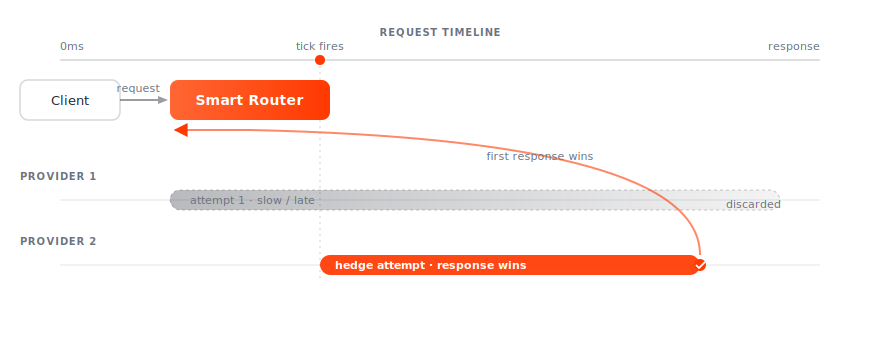

# Hedge

If a relay hasn't returned by a fixed deadline, Smart Router fires the **same request** to a second provider in parallel. The first response back wins; the slower attempt is discarded.

## What it solves

Tail latency. With hedging off, a provider that's slower than its 99th-percentile but not yet timed out drags every request behind it. With hedging on, the slow provider's tail gets cut off by the fastest of N parallel attempts.

## How it triggers

A ticker runs in the relay state machine. On each tick, if no response has been received and an attempt slot is free, a new attempt is fired. Subsequent ticks continue firing parallel attempts up to the retry cap.

The mechanism is the same as retry — the only difference is *why* the next attempt is fired:

| Trigger | What it's called |
|---|---|
| Previous attempt errored | retry |
| Previous attempt is taking too long | hedge |

Both increment the same retry counter. Both cap at 10 attempts per relay.

## When hedges win

| Scenario | Hedge helps? |
|---|---|
| One slow provider, others fast | yes — hedge skips the slow one |
| All providers slow | no — fastest is still slow |
| One unresponsive provider | yes — but [retry](retry.md) does this too once it errors |
| Tail latency on indexer-style heavy reads | yes — significant p99 improvement |
| Write traffic (`sendRawTransaction`) | use [fast TX fanout](../../api/url.md) instead — fans out unconditionally |

## When to be cautious

- **Cost** — every hedge fires a real upstream request. Cost-sensitive deployments with high traffic should weigh hedge gains against per-call upstream pricing.
- **Idempotency** — hedging non-idempotent calls (writes that mutate state on the upstream) can produce duplicate side effects. Smart Router doesn't currently distinguish; if your upstream protocol is non-idempotent, disable hedging or accept the risk.
- **Provider rate limits** — hedging multiplies your request rate against each provider. Make sure your selection policy spreads attempts across the pool.

## Configuration

The hedge tick interval is currently chain-derived (from `average_block_time` and per-method category) rather than a YAML knob. The maximum hedge attempts share the 10-attempt cap with retries — see [Retry](retry.md).

## Observability

| Metric | Meaning |
|---|---|
| `incident_hedge_*` | per-incident hedge telemetry (Kafka analytics) |
| `smartrouter_hedge_count` | total hedge attempts |
| `analytics.HedgeCount` | per-relay hedge count in the analytics record |
| Tracing | each hedged attempt is a parallel span under the same parent |
