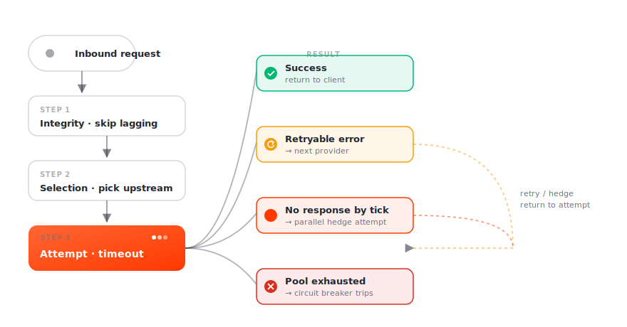

# Failover & retry

The umbrella for everything Smart Router does when a relay misbehaves: a provider is slow, returns an error, or disagrees with its peers. Each policy is independent; they compose during a single relay's lifetime.

## Policies

| Policy | Trigger | What it does |
|---|---|---|
| [**Retry**](retry.md) | upstream returns a retryable error | rotates to a different provider; up to 10 attempts |
| [**Hedge**](hedge.md) | request hasn't returned within a tick | fires a parallel attempt to another provider; first response wins |
| [**Timeout**](timeout.md) | per-attempt or overall budget exceeded | aborts; lets retry rotate |
| [**Consensus**](consensus.md) | data correctness matters (cross-validation enabled) | fans out to N providers; requires agreement |
| [**Integrity**](integrity.md) | out-of-sync provider | pre-request lag check skips lagging providers before they're picked |
| [**Circuit breaker**](circuit-breaker.md) | repeated pairing failures | trips the relay early instead of retrying forever |

## How they compose

The overall timeout (`--default-processing-timeout`) wraps the whole pipeline; if it fires, whatever's most useful is returned. Per-attempt timeouts (`--min-relay-timeout` floor or `lava-relay-timeout` header) bound each individual try.

The orchestrator is the relay state machine in [`protocol/relaycore/unified_relay_state_machine.go`](https://github.com/Magma-Devs/smart-router/blob/main/protocol/relaycore/unified_relay_state_machine.go). The retryable-vs-terminal classifier is in [`protocol/common/error_classifier.go`](https://github.com/Magma-Devs/smart-router/blob/main/protocol/common/error_classifier.go).

## What's tunable

Smart Router's failover policies fall into three groups:

| Group | Examples | Where tuned |
|---|---|---|
| CLI flags | `--default-processing-timeout`, `--min-relay-timeout` | startup args |
| Per-request headers | `lava-relay-timeout`, `Lava-Provider-Address` | HTTP headers — see [Directives](../../api/directives.md) |
| Chain-derived defaults | retry count, integrity lag threshold, hedge tick | computed from the chain spec; not currently exposed as YAML |

Where a knob isn't tunable, that's called out on the policy's page.

## Observability

Every policy emits Prometheus metrics on the `--metrics-listen-address` endpoint (default `:7779`). Each policy page below names the metric series it emits. OpenTelemetry traces cover the full relay lifecycle — set `OTEL_EXPORTER_OTLP_ENDPOINT` to point at your collector.
