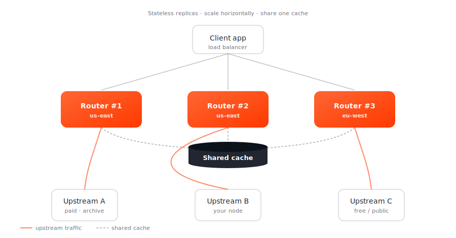

# Deployment (on-premise)

Smart Router is built to run on your own infrastructure. The binary is a single Go executable; the only piece of state to think about is the optional [shared cache](../configuration/index.md), which runs as a separate process. There are no external service dependencies beyond the upstream RPC providers you configure.

!!! note "Looking for a managed option?"

    If you'd rather not operate the router yourself, [talk to us](https://magmadevs.com/contact). The pages in this section assume self-hosted.

## Pick a path

| You want | Go to |
|---|---|
| The fastest way to a running container | [Docker](docker.md) |
| Production deployment with horizontal scale | [Kubernetes](kubernetes.md) |
| A native binary on a VM, managed by systemd | [Bare metal](bare-metal.md) |

## Architecture

A typical on-premise deployment has three components:

The router replicas are stateless. State that needs to be shared (cache, observed provider QoS) lives in the standalone cache process, which any number of routers connect to via `--cache-be host:port`.

## Network ports

| Port | Process | Purpose |
|---|---|---|
| `3360` (default in Dockerfile, override per endpoint in YAML) | router | request listener — one port per `endpoints[]` entry |
| `7779` (default in Dockerfile) | router | Prometheus `/metrics` |
| configured via `cache` subcommand | cache | cache-server listener (referenced by `--cache-be`) |

Each chain × API-interface pair gets its own listener port. The Lava setup, for example, uses 3360 (REST), 3361 (gRPC), 3362 (Tendermint RPC).

## What you need

- **CPU**: 2+ cores per router replica is a good starting point; the router is mostly I/O bound.
- **Memory**: 1–2 GiB per replica baseline.
- **Disk**: negligible — router replicas are stateless. Cache server can use disk for persistence depending on its driver.
- **Network**: low-latency egress to your upstream providers matters more than raw bandwidth.
- **Outbound TLS**: most public providers require HTTPS / TLS gRPC — make sure your egress allows it.

## Configuration in production

- **Externalise secrets**: never bake API keys into images. Use environment variables or your secret manager.
- **Multi-region**: set `--geolocation` per-replica so the provider optimizer prefers nearer upstreams.
- **Observability**: scrape the metrics endpoint; pipe logs to your log aggregator; set the OTel endpoint for [tracing](../configuration/index.md).
- **Health checks**: each listener responds to a basic chain-id query; see the per-chain pages under [Reference → Supported chains](../reference/chains/index.md).
