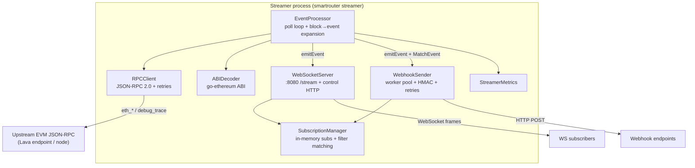
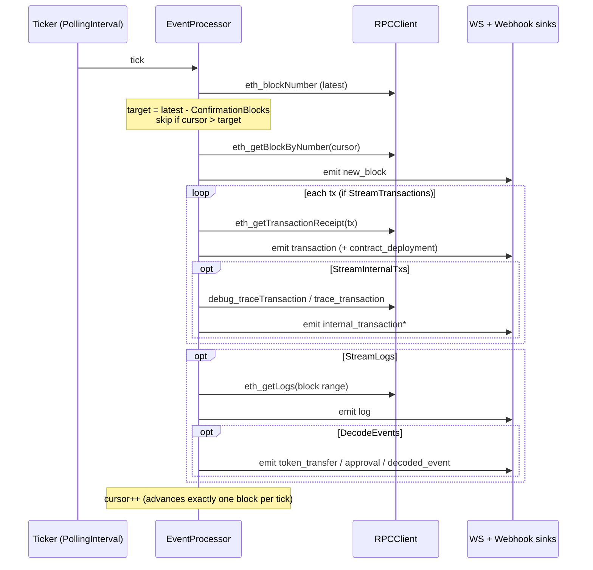

# Lava Event Streamer — Design Overview

A concise architectural overview of the `protocol/streamer` package. For usage details and
examples see [`README.md`](./README.md) and [`COMPREHENSIVE_GUIDE.md`](./COMPREHENSIVE_GUIDE.md);
this document focuses on *how the system is built and why*.

---

## 1. Purpose & Philosophy

The streamer turns an EVM chain's blocks into a **real-time feed of typed events** that clients
consume over **WebSocket** or **HTTP webhooks**. It reads from an upstream JSON-RPC endpoint —
typically a Lava RPC endpoint, but any EVM RPC works — and pushes matching events to subscribers.

It is deliberately **stateless** and **not an indexer**:

| It **is**… | It is **not**… |
|---|---|
| A real-time delivery service | A historical query engine |
| In-memory only (no DB) | A durable, replayable event store |
| Best-effort "what's happening now" | A source of truth with completeness guarantees |
| A fan-out layer on top of JSON-RPC | A node or a tracer of its own |

The design bias is **simplicity and low operational footprint** over throughput and delivery
guarantees. Understanding that trade-off explains most of the choices below.

---

## 2. Architecture



`Streamer` (`streamer.go`) is the composition root: it validates config, constructs all seven
components, wires them together, and manages lifecycle (`Start` / `Stop` / signal-based shutdown).

### Component responsibilities

| Component | File | Responsibility |
|---|---|---|
| `Streamer` | `streamer.go` | Composition root; lifecycle; graceful shutdown |
| `EventProcessor` | `event_processor.go` | Poll loop, block/tx/log → `StreamEvent`, fan-out |
| `RPCClient` | `rpc_client.go` | JSON-RPC 2.0 over HTTP, retries, EVM types |
| `ABIDecoder` | `abi_decoder.go` | Decode logs into typed events (ERC20/721 + custom) |
| `SubscriptionManager` | `subscription_manager.go` | In-memory subscription registry + filter matching |
| `WebSocketServer` | `websocket_server.go` | WS connections, control HTTP endpoints, broadcast |
| `WebhookSender` | `webhook_sender.go` | Async webhook delivery with retries + HMAC signing |
| `StreamerMetrics` | `metrics.go`, `types.go` | Runtime counters |

---

## 3. Data Flow

The `EventProcessor` is the engine. Everything is driven by a single ticker:



**Fan-out (`emitEvent`)** — every event is delivered to two independent sinks:

1. **WebSocket**: pushed non-blocking onto a buffered channel (`SendEvent`); a broadcaster
   goroutine matches it against active subscriptions and writes JSON to each matching connection.
2. **Webhook**: `SubscriptionManager.MatchEvent` finds subscriptions with a webhook configured;
   each match is enqueued to the webhook worker pool.

The two paths are decoupled — a slow webhook endpoint cannot block WebSocket delivery, and vice versa.

---

## 4. Event Model

All output is a single envelope type, `StreamEvent` (`types.go`), with a `Type` discriminator and
a free-form `Data map[string]interface{}` payload:

```
new_block · transaction · internal_transaction · log ·
decoded_event · token_transfer · token_approval ·
nft_transfer · nft_approval · contract_deployment
```

Raw EVM JSON-RPC structs (`EVMBlock`, `EVMTransactionReceipt`, `EVMLog`) are converted into
streaming-friendly shapes (`Block`, `Transaction`, `Log`) before emission — hex is parsed to
`int64`, topics are flattened to `Topic0..3`, etc.

---

## 5. Subscription & Filtering Model

Subscriptions live in an in-memory `map[string]*Subscription` guarded by an `RWMutex`
(`subscription_manager.go`). A subscription carries an `EventFilter` and either a live WebSocket
connection or a `WebhookConfig`.

`MatchEvent` walks all active subscriptions and applies `eventMatchesFilter` per event. Supported
filter dimensions (`EventFilter` in `types.go`):

- **Type / chain**: `event_types`, `chain_id`
- **Block range**: `from_block`, `to_block`
- **Addresses**: `from_address`, `to_address`, `contract_address`, or `addresses` (match-any)
- **Logs**: `topics`, `decoded_event_type`
- A `nil` filter matches **everything**.

Ways to subscribe:

- **WebSocket control messages** — send `{"action":"subscribe","filters":{…}}` over the socket.
- **HTTP** — `POST /subscribe` (with an optional `webhook` block) and `POST /unsubscribe`.

A background goroutine runs every 5 minutes to sweep subscriptions marked inactive (see the
lifecycle caveat in §12, item 8 — in the current code this sweep reclaims little in practice).

> **Note on `watched_contracts`:** this config drives **ABI registration for decoding**, keyed by
> contract address. It is *not* pushed down as an `eth_getLogs` address filter — the processor
> fetches **all** logs for each block and decodes those whose address has a registered ABI.
> Address narrowing happens at the subscription layer, not at the RPC layer.

---

## 6. Delivery Channels & Semantics

### WebSocket (`websocket_server.go`)
- Serves `/stream` (upgrade), plus control endpoints `/subscribe`, `/unsubscribe`, `/health` on
  `WebSocketAddr` (default `:8080`).
- Buffered `eventChan` (size = `MaxEventsBufferSize`); a single broadcaster goroutine fans out.
- Periodic ping keep-alives; connection cap via `MaxWebSocketClients`.
- **Semantics: at-most-once.** If the buffer is full, `SendEvent` drops the event (logged).

### Webhook (`webhook_sender.go`)
- A pool of `WebhookWorkers` goroutines drains a buffered `eventQueue`.
- `POST`s the JSON event with metadata headers (`X-Lava-Event-Type`, `X-Lava-Event-ID`, …).
- Optional **HMAC-SHA256** signature (`X-Lava-Signature`) when a per-subscription `secret` is set.
- Retries with linear backoff up to `WebhookMaxRetries`; 2xx counts as delivered.
- **Semantics: best-effort at-least-once** (retries may duplicate); events are dropped if the
  queue is full.

Neither channel persists undelivered events — there is no replay.

---

## 7. RPC Access Layer

`RPCClient` (`rpc_client.go`) speaks **JSON-RPC 2.0 over HTTP POST** to a single endpoint, with a
30s HTTP timeout and a retry loop (linear backoff: `retryDelay × attempt`). Methods used:

`eth_blockNumber` · `eth_getBlockByNumber` · `eth_getTransactionReceipt` · `eth_getLogs`

**Internal transactions** (`internal_transactions.go`) use `debug_traceTransaction` with the
`callTracer`, recursively flattening the call tree into a list; if the node doesn't support it,
it falls back to Parity/OpenEthereum-style `trace_transaction`. This requires a **trace-capable**
upstream and is off by default (`StreamInternalTxs`).

---

## 8. ABI Decoding

`ABIDecoder` (`abi_decoder.go`) uses `go-ethereum/accounts/abi`. It preloads standard ERC20/ERC721
ABIs and recognizes common signatures (Transfer, Approval, ApprovalForAll, Swap, Mint, Burn).
Per-contract ABIs from `watched_contracts` are registered by address. When `DecodeEvents` is on,
each raw log with a known ABI additionally yields a `decoded_event` (specialized to
`token_transfer` / `token_approval` where recognized).

---

## 9. Configuration & Operational Surface

Config is YAML, unmarshaled into `StreamerConfig` (`config.go`). `Validate()` enforces the two
required fields (`rpc_endpoint`, `chain_id`) and fills sensible defaults for everything else.

Key knobs: `polling_interval` (6s), `confirmation_blocks`, `start_block` (0 = latest), the
`stream_*` toggles, `decode_events`, buffer/worker sizes, and the WebSocket/webhook settings.

Default ports:

| Surface | Default | Wired today? |
|---|---|---|
| WebSocket + control HTTP | `:8080` | ✅ served by `WebSocketServer` |
| Standalone API server (`api_listen_addr`) | `:8081` | ⚠️ config only — not started in `Start()` |
| Metrics server (`metrics_addr`) | `:9090` | ⚠️ config only — not started in `Start()` |

> The config surface is broader than what the current `Start()` wires up; `enable_api` /
> `enable_metrics` and their addresses are placeholders for planned standalone servers. The
> health/control endpoints that *do* exist are hosted on the WebSocket server's address.

---

## 10. CLI

Registered in `cmd/smartrouter/streamer.go` as a Cobra command on `smartrouter`:

```bash
smartrouter streamer streamer.yml          # run with a config file
smartrouter streamer                       # run with defaults (or ./streamer.yml if present)
smartrouter streamer --example-config > streamer.yml   # emit an annotated example config
```

---

## 11. Concurrency Model

| Goroutine | Count | Role |
|---|---|---|
| `processBlocks` | 1 | The single block-advancing loop (serial) |
| `reportMetrics` | 1 | Periodic metrics log |
| WS broadcaster | 1 | Drains `eventChan`, writes to sockets |
| WS ping | 1 | Keep-alive pings |
| WS connection handler | 1 per client | Reads inbound control messages |
| Webhook worker | `WebhookWorkers` | Drains webhook queue, delivers |
| Subscription cleanup | 1 | Sweeps inactive subs every 5m |

Shared state is protected by `RWMutex` (subscriptions, WS connection map). Block processing is
intentionally **serial** — one block at a time, one cursor.

---

## 12. Design Trade-offs & Known Limitations

These follow directly from the "simple, stateless, best-effort" bias and are worth knowing before
depending on the streamer:

1. **Catch-up is bounded to one block per tick.** `processNextBlock` advances the cursor by a
   single block each `PollingInterval`. If the chain's block time is faster than the interval (or
   after downtime), the streamer **falls progressively behind** and never recovers on its own.
   Sizing `polling_interval` below block time — or batching multiple blocks per tick — is required
   for fast chains.

2. **N+1 RPC pattern.** Each transaction triggers a separate `eth_getTransactionReceipt`, issued
   serially. On busy blocks this dominates latency and upstream load. Timestamps on `transaction`
   events are also currently left at `0`.

3. **No reorg handling.** `confirmation_blocks` adds lag but there is no reorg detection or
   rollback; the log `removed` flag is carried through but not acted upon.

4. **Best-effort delivery, no replay.** Both channels drop events under back-pressure (full
   buffer/queue) and nothing is persisted. Subscribers must tolerate gaps.

5. **Metrics are not race-safe.** `types.go`'s `StreamerMetrics` uses plain `int64` fields
   incremented from multiple goroutines (webhook workers + processor). An atomic
   `StreamerMetricsImpl` exists in `metrics.go` but is **currently unused** — wiring it in (or
   using `atomic` ops) would remove the data race.

6. **Filtering is O(subscriptions) per event** under a single lock — fine at modest scale, a
   bottleneck at very high subscription counts or event rates.

7. **Open CORS / no auth.** The WebSocket upgrader allows all origins and the control endpoints are
   unauthenticated — acceptable for trusted deployments, not for direct public exposure.

8. **Dropped WebSocket subscriptions leak.** On disconnect, `handleConnection` removes the socket
   from the server's connection map but never calls `SubscriptionManager.Unsubscribe`, so the
   subscription stays `Active=true` with a stale connection and is never reclaimed. And because
   `Unsubscribe` both flags *and* immediately deletes, the 5-minute `CleanupInactive` sweep finds
   nothing to remove in practice. Cleanup should be triggered from the connection's teardown path.

---

## 13. Extension Points

- **New event types** — add a `StreamEventType` constant and emit it from `EventProcessor`.
- **New filters** — extend `EventFilter` and `eventMatchesFilter`.
- **New delivery channels** — add a sink and call it from `emitEvent` (mirror the WS/webhook split).
- **Richer decoding** — register more ABIs / signatures in `ABIDecoder`.
- **Throughput** — batch blocks per tick, parallelize receipt fetches, or push down `eth_getLogs`
  address filters from `watched_contracts`.
